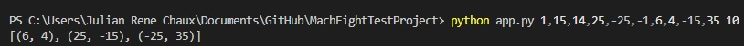
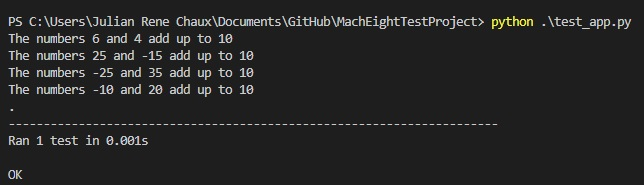
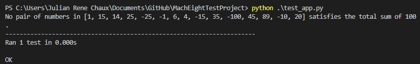

 MachEight Test Project

<details open="open">
  <summary>Table of Contents</summary>
  <ol>
    <li><a href="#About-this-Repository">About This Repository</a></li>
    <li><a href="#Using-this-Repository">Using this Repository</a></li>
    <li><a href="#Using-the-Main-Application">Using the Main Application</a></li>
    <li><a href="#Using-the-Tests">Using the Tests</a></li>
    <li><a href="#Requirements">Requirements</a></li>
    <li><a href="#Author">Author</a></li>
  </ol>
</details>

## About this Repository
This repository is the proposed solution to the coding challenge for MachEight.  The requirements are described in the file [README_entry_level.md](README_entry_level.md)

----
## Using this Repository

* Move into a folder and clone the repository:
```
git clone https://github.com/julianchaux/MachEightTestProject.git
```

----
## Using the Main Application

The task is to write a function that finds pairs of integers from a list that sum to a given value. The function will take as input the list of numbers as well as the target sum.  The requirements described in [README_entry_level.md](README_entry_level.md) assume that all input values are integers and that there are no repeated values in the list.:
```
git clone https://github.com/julianchaux/MachEightTestProject.git
```


----
## Using the Tests

* XXXXXX:
```
git clone https://github.com/julianchaux/MachEightTestProject.git
```



----
## Requirements

**Program tested with:**
* Python 3.9.12

----
## Author

Julián René Cháux Cedeño - [Profile Link](https://www.linkedin.com/in/julianrenechaux-robotics-ai/)  
